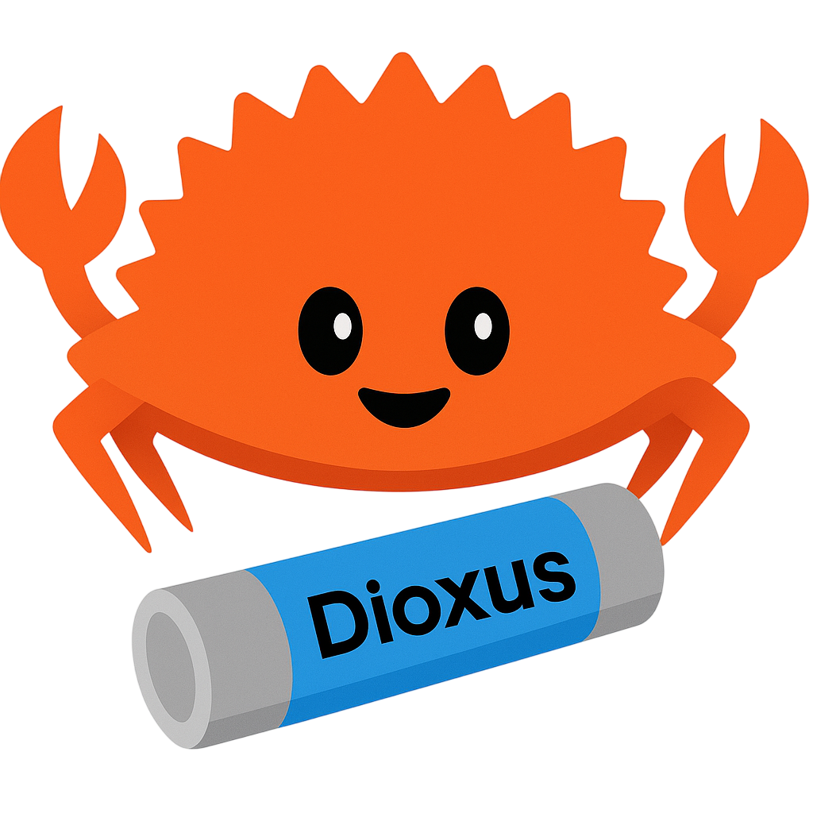

<div align="center">
    
</div>

# Reslt - Component Library & CLI for Dioxus

A powerful ecosystem for Dioxus applications featuring a reactive table component library, a CLI tool for component management, and a registry of ready-to-use UI components.

## 🎥 on YouTube  

[](https://www.youtube.com/watch?v=EDeWMxA82Mg)  

👉 **Click the thumbnail or [here](https://www.youtube.com/watch?v=EDeWMxA82Mg) to watch the video.**

## 📦 Ecosystem

Reslt consists of three main parts:

1. **reslt** - The core table component library with sorting, pagination, and filtering
2. **reslt-cli** - A command-line tool for adding components from a registry to your projects
3. **reslt-component** - A registry of pre-built UI components with multiple style variants

## ✨ Features

### Core Table Library (`reslt`)
- 📊 Fully reactive data tables
- 🔄 Sorting functionality
- 📑 Pagination support
- 🔍 Filtering capabilities
- 🎨 Customizable styling with Tailwind CSS
- 📱 Responsive design
- 🧩 Modular components

### CLI Tool (`reslt-cli`)
- 🚀 Quick component installation
- 📋 Component discovery and search
- 🎨 Multiple style variants (Tailwind CSS & Raw CSS)
- 🔧 Automatic project integration
- 📦 Local registry support

### Component Registry (`reslt-component`)
- 📚 Collection of ready-to-use components
- 🎯 Multiple variants per component
- 💅 Tailwind CSS and Raw CSS styles
- 📦 Dioxus 0.7 compatible

## 📚 Available Components

The component registry includes:

| Component | Variants | Styles |
|-----------|----------|---------|
| **Toast** | Default | Tailwind, Raw CSS |
| **Modal** | Default | Tailwind, Raw CSS |
| **Skeleton** | Default | Tailwind, Raw CSS |
| **Checkbox** | Default | Tailwind, Raw CSS |
| **Table** | Default | Tailwind, Raw CSS |

## 🚀 Installation

### Install the Core Library

Add the core library to your `Cargo.toml`:

```toml
[dependencies]
reslt = { version = "0.1.0" }
```

### Install the CLI Tool

The CLI tool can be installed via cargo:

```bash
cargo install --path ./reslt-cli
```

Or run it directly from source:

```bash
cd reslt-cli
cargo run -- --help
```

## 🔧 Using the CLI

The CLI tool allows you to quickly add components to your Dioxus projects.

### List Available Components

```bash
reslt list
```

### Search for Components

```bash
reslt search toast
```

### Add a Component

Add a component to your project:

```bash
reslt add toast-default-tailwind
```

Add a component with raw CSS styling:

```bash
reslt add modal-default-rawcss
```

Add to a specific output directory:

```bash
reslt add skeleton-default-tailwind --output ./src/components
```

Skip automatic `mod.rs` updates:

```bash
reslt add checkbox-default-tailwind --no-mod
```

### Use a Custom Registry

By default, the CLI looks for a local registry at `../reslt-component/registry`. You can specify a custom registry:

```bash
reslt --registry-url /path/to/registry add toast-default-tailwind
```

## 📖 Quick Start

### Using the Table Component

```rust
use dioxus::prelude::*;
use reslt::prelude::*;

// Define your data structure
#[derive(Clone, Debug, PartialEq, Eq, Serialize, FieldAccessible)]
struct Person {
    id: u32,
    name: String,
    age: u32,
    city: String,
}

// Create a function to fetch data
fn get_person_data(start: usize, end: usize, sort: (String, bool)) -> Pin<Box<dyn Future<Output = (PropData<Person>, usize)>>> {
    Box::pin(async move {
        // Your data fetching logic here
        // ...
    })
}

// Create table columns
fn create_columns() -> PropCol<Person> {
    PropCol {
        cols: vec![
            Col {
                head: "Name".to_owned(),
                index: "name".to_owned(),
                class: None,
                action: None,
            },
            Col {
                head: "Age".to_owned(),
                index: "age".to_owned(),
                class: Some("text-right".to_owned()),
                action: None,
            },
            // Add more columns as needed
        ],
    }
}

#[component]
fn App() -> Element {
    let cols = create_columns();
    let table = use_table(get_person_data, cols);

    rsx! {
        DefaultTable { table }
    }
}
```

### Using Components from the Registry

After adding a component with the CLI, you can use it in your application:

```rust
use dioxus::prelude::*;
/// // Import from your project structure, e.g.:
/// // use components::toast::Toast;

#[component]
fn App() -> Element {
    let mut show_toast = use_signal(|| false);

    rsx! {
        button {
            onclick: move |_| show_toast.set(true),
            "Show Toast"
        }
        
        if show_toast() {
            Toast {
                message: "Hello, World!".to_string(),
                on_close: move |_| show_toast.set(false),
            }
        }
    }
}
```

## 🏗️ Development

### Prerequisites

- Rust and Cargo
- Node.js and npm (for Tailwind CSS)

### Setup

1. Clone the repository
2. Install dependencies:
   ```bash
   npm install
   ```
3. Run Tailwind CSS compiler:
   ```bash
   npx tailwindcss -i ./assets/input.css -o ./assets/output.css --watch
   ```

### Running Examples

#### Table Component Example
```bash
cd examples
dx serve
```

#### CLI Tool Development
```bash
cd reslt-cli
cargo run -- list
cargo run -- add toast-default-tailwind
```

### Adding Components to the Registry

Components in the registry follow this structure:

```
<name>-<variant>-<style>/
├── metadata.json          # Component metadata and configuration
├── component.rs          # Main component file
├── <name>.rs            # Component implementation
└── <name>.css           # CSS styles (for raw CSS variants)
```

Example: `toast-default-tailwind/`

#### metadata.json Format

```json
{
  "name": "toast",
  "variant": "default",
  "style": "tailwind",
  "version": "0.1.0",
  "description": "A toast notification component",
  "category": "feedback",
  "files": ["component.rs"],
  "dependencies": {
    "dioxus": "0.7.1"
  },
  "requires_tailwind": true
}
```

## 📚 Documentation

For detailed documentation and examples:
- **Table Component**: See the examples directory
- **CLI Tool**: Run `reslt --help` for command documentation
- **Component Registry**: Check the `reslt-component/registry` directory

## 🤝 Contributing

Contributions are welcome! You can:

1. Add new components to the registry
2. Improve the table component
3. Enhance the CLI tool
4. Fix bugs and improve documentation

Please feel free to submit a Pull Request!

## 📄 License

MIT

## 🔗 Links

- [GitHub Repository](https://github.com/lidm0707/reslt)
- [Dioxus Documentation](https://dioxuslabs.com/learn/0.7)
- [Component Registry](https://github.com/lidm0707/reslt/tree/main/reslt-component)